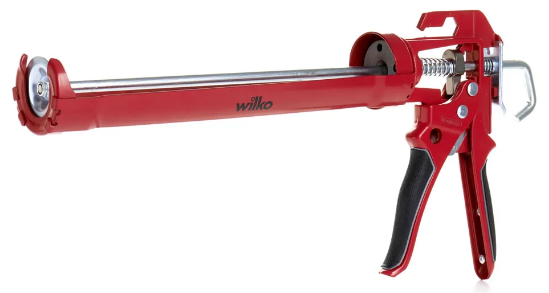
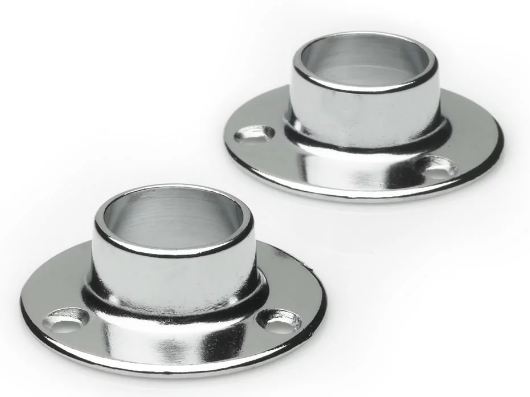
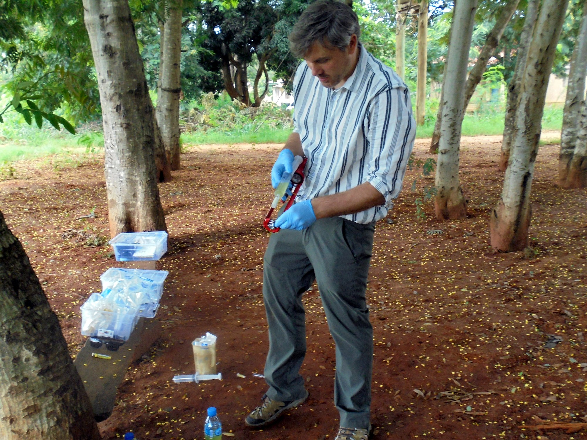
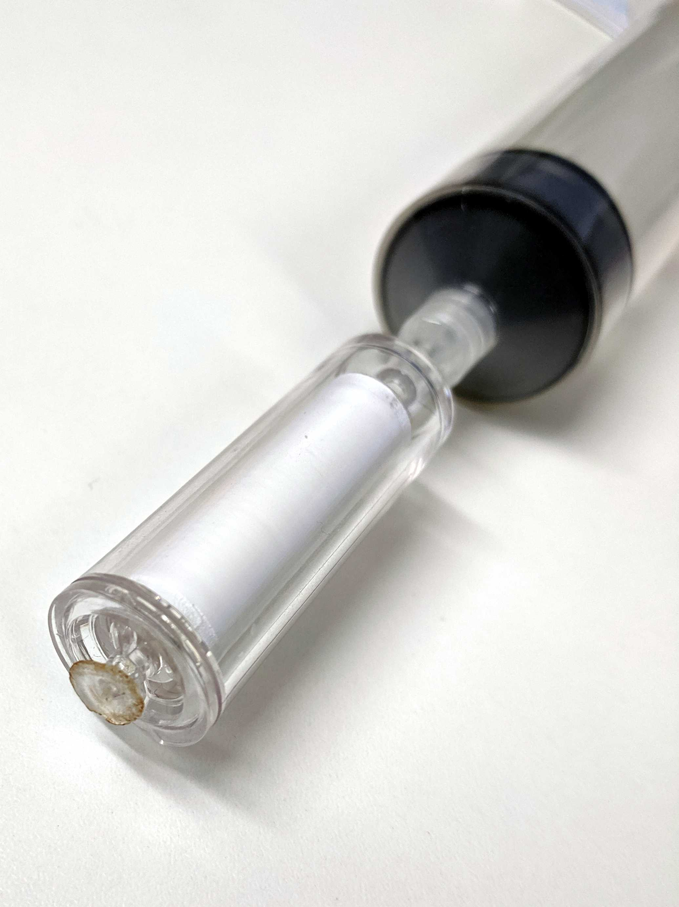
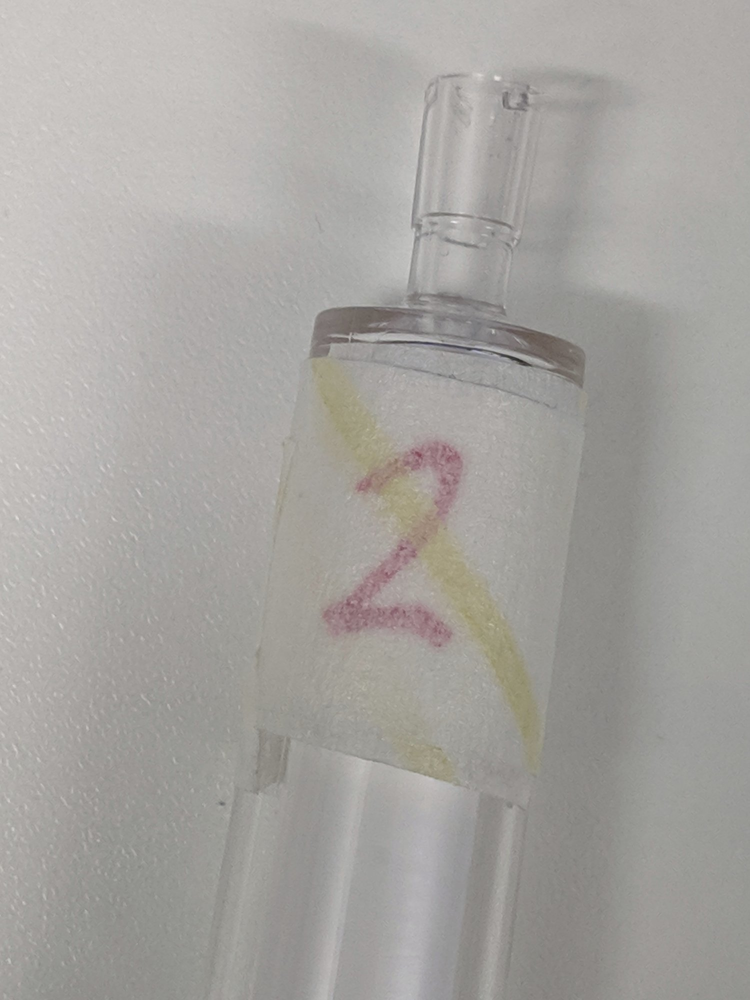
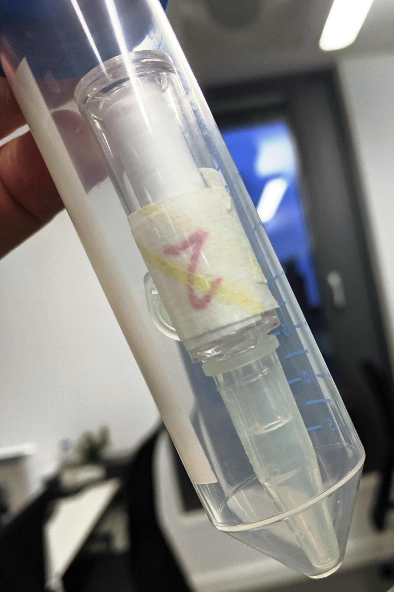

# Protocols for eDNA sampling abroad
### Rupert A. Collins :: August 2019

Sampling trips involving air travel and lengthy fieldwork create problems for eDNA sample storage. Here is a simple procedure for eDNA capture, storage, and extraction.

### Sampling procedure in the field

Kit required (manufacturers and part numbers are presented in Table 1 at the bottom): 

 * Sterivex filters
 * ATL buffer
 * Whirl-Pak bags
 * Sealant gun and securing rings (plus a spare)
 * 50 mL syringes
 * 1 mL syringes
 * Combistoppers
 * Zip-lock bags 
 * Label paper (120 gsm archival-grade acid-free)
 * Scissors
 * Disposible gloves
 * Gel pens
 * Marker pens
 * Cable ties or wire
 * Cigarette lighter
 * Storage/working box

##### Steps:

1. For a collecting container, 1-2 L bottles of drinking water can be purchased locally, and can serve as disposible sampling bottles. Wearing disposible gloves, empty the bottle and rinse it in your sample water. Fill up the bottle under the surface. If debris or sediment are present, allow to settle for 15 min in the shade. Consider a prefilter if sediment/algal load is high.
2. Cable tie or wire the rail socket rings to the sealant gun to form a holder to secure the syringe.

3. Open a 50 mL syringe and a Sterivex filter. Twist the syringe into the Sterivex luer connection inlet.
4. Remove syringe plunger, fill with sample water and re-insert the plunger. Place in the sealant gun by putting the Sterivex through the hole in the ring.
5. Align the syringe and gun, and squeeze the trigger GENTLY to push water through. It's better to apply a slow, steady, gentle pressure; squeezing too hard can easily burst the Sterivex!

6. Repeat until water is only dripping through very slowly.
7. Record the number of syringes filled (= total mL filtered) on the label along with site code and date etc. Use gel pen or pencil for this, never biro or "permanent" marker.
8.  Fill the syringe with air and force remaining water out of the Sterivex. Repeat until all water has been removed. Water will dilute the preservative buffer.
9.  Using the cigarette lighter, heat the outlet of the Sterivex until it melts. Gently press and twist against a hard metal surface (e.g. the sealant gun) to permanently seal the end of the Sterivex. See:

10.  Change gloves.
11.  Fill a sterile 1 mL syringe with ATL buffer (from aliquoted stock), going as far as possible to take in 1.1 mL.
12.  Insert the syringe into the Sterivex inlet and slowly inject one-third of the contents of the syringe (367 &micro;L). Before removing the syringe, tap the Sterivex to ensure the buffer drains from the neck of the Sterivex. Because of the pressure, sometimes the buffer comes straight back out, so be careful of that.
13.  One syringe of ATL buffer will do three Sterivex. NEVER put the syringe back into the ATL buffer once it has been inserted in a Sterivex. Use a new syringe for further samples.
14.  Use a combistopper to seal the luer end of the Sterivex. Shake to mix the ATL buffer over the filter.
15.  Place 3x Sterivex in Whirl-Pak bag with accompanying label, and place this bag in a zip lock bag.
16.  For storage, keep the filters as cool and dark as possible. Avoid freezing for short periods. Refrigeration is good if available. Samples will be okay for several weeks, and to bring back in hold luggage. 

### DNA extraction procedure back in the lab

Kit required (manufacturers and part numbers are presented in Table 1 at the bottom): 

* DNeasy Blood & Tissue Kit
* 50 mL centrifuge tubes
* 1.5 mL microcentrifuge tubes
* 1.5 mL microcentrifuge tubes (LoBind)
* Bleach 
* Absolute ethanol
* Paper towels
* Disposible gloves
* White masking tape

Things to do before you start (usually the night before):

* Wipe down the surfaces, oven, centrifuge, pipettes, door handles, everything, with 70% ethanol followed by 10% bleach, followed by 70% ethanol.
* Soak the centrifuge rotors in 10% bleach solution for no longer than 2 h (the rotor may corode if left too long), triple rinse, and dry.
* Mop the floor with 5% bleach solution.
* Run the UV lamp for at least 2 h. 
* Ensure you have sufficient gloves, towels, tips, sweetie jars, tubes etc.

##### Important notes:

* It is important to do the ethanol-bleach-ethanol because several of the extraction buffers contain chaotropic salts that react with bleach to form highly toxic compounds (basically mustard gas!). If formed this compound will appear yellow on the paper towels and may smell pleasant and garlicky.
* ALWAYS use filter tips.
* ALWAYS change gloves after EVERY step.
* ALWAYS number every tube.
* Make aliquots of all your buffers and reagents because you could easily spill or contaminate them.
* For every extraction day in the lab, also do an extraction blank with just extraction reagents and no Sterivex; otherwise treat it the same as the others. 
* Read the full [DNeasy kit instructions](https://www.qiagen.com/us/resources/download.aspx?id=6b09dfb8-6319-464d-996c-79e8c7045a50&lang=en) to understand the basics of nucleic acid isolation.
* Photograph your lab book at the end of every day as a backup.

##### Steps:

1. Turn on the oven and preheat the AL and AE buffers at 56&#176;C.
2. Label the Sterivex by putting on masking tape, writing on the number, then another layer of tape. This means that the labels will not be lost should one of the Sterivex leak in the shaker. See:

3. Open the Sterivex, add 20 &micro;L of proteinase K. Close with the same combistopper and shake to mix.
4. Put in the oven shaker to incubate for 2 h. Return after 1 h to rearrange and check; this makes sure some samples don't get stuck and stop moving.
5. Remove combistopper and place an inverted 1.5 mL microcentrifuge tube over the Sterivex inlet. Place an inverted 50 mL centrifuge tube over the top of both. Quickly flip so tubes are back the right way up and the Sterivex contents can drain into the microcentrifuge tube. See:

6. Centrifuge for 1 min at 4,000 g.
7. With sterilised tweezers remove the Sterivex and discard. Then remove the 1.5 mL microcentrifuge tube carefully.
8. Centrifuge the sample for 1.5 min at 13,000 g to collect debris.
9. Transfer 350 &micro;L of supernatant to a new 1.5 mL microcentrifuge tube. Take care to not disturb the pellet. Discard tube with debris.
10. In a new 50 mL centrifuge tube prepare a mastermix of buffer AL (pre-warmed) and ethanol. You will need 350 &micro;L of each for every sample, plus 10% extra. So, for 5 samples, add 1,925 &micro;L of buffer AL and 1,925 &micro;L of ethanol. Vortex to mix.
11. Add 700 &micro;L of this mastermix to your supernatant, and vortex each samples IMMEDIATELY (important).
12. Add 525 &micro;L of this mixture from step 11 to the DNeasy spin column.
13. Centrifuge for 1.5 min at 13,000 g.
14. Remove the column from the collection tube and carefully pipette out the liquid from the collection tube and discard this liquid by ejecting the full pipette tip.
15. Repeat steps 12/13 to pass another 525 &micro;L through the column.
17. Discard collection tube and contents, and place column in new collection tube.
18. Add 525 &micro;L buffer AW1 to the spin column and centrifuge for 1.5 min at 13,000 g. 
19. Discard collection tube and contents, and place column in new collection tube.
20. Add 525 &micro;L buffer AW2 to the spin column and centrifuge for 1.5 min at 13,000 g. 
21. Use a pipette to remove the liquid from the collection tube as before.
22. Centrifuge the spin column and empty collection tube again, this time for 3 min at 20,000 g.
23. Transfer the column to a new 1.5 mL microcentrifuge tube with the lid cut off.
24. Open the spin column lid for 2 min to allow ethanol to evaporate.
25. Add 105 &micro;L of the pre-warmed AE elution buffer. 
26. Close lids and incubate in the oven at 56&#176;C for 5 mins. 
27. Centrifuge the spin column at 13,000 g for 1.5 mins to release the DNA.
28. Pipette the eluate back into the spin column and repeat step 26.
29. Transfer the eluate into a 1.5 mL LoBind microcentrifuge tube.
30. Nanodrop 2 &micro;L and record DNA concentration (ng/&micro;L) as well as the 260/280 and 260/230 ratios.
31. Freeze in the eDNA freezer.
32. For a tube labelling system, I write the date, and the extraction number from that day, e.g. 08.08.19/4 which would be the forth sample done on the 8th of August 2019. Refer to the lab book to know which field event this corresponds to.

### Table 1. Parts and prices
Item | Quantity | Cost (excl. VAT)| Company | Part no.
--- | --- | --- |--- |---
Sterivex filter 0.22 &micro;m | 50 | £245 | Millipore | SVGP01050
Whirl-Pak sample bag (75 x 125 mm) | 500 | £50.19 | SLS| BAG2504
50 mL luer-lock syringe | 25 | £16.90 | SLS | BS-50L
1 mL luer-slip syringe | 100 | £6.20  | Appleton Woods | BD572
DNeasy Blood & Tissue kit | 250 | £489.77 | Qiagen | 69506
Buffer ATL | 4 x 50 mL | £55.40 | Qiagen | 939016
Combistopper | 100 | £11.67 | B Braun | 4495152
Heavy duty sealant gun | 1 | £6.00 | Wilko | 0427805
19mm rail socket | 2 | £3.00 | Wilko | 4382054
50 mL Centrifuge Tube | 500 | £48.48 | Starlab UK | E1450-0200
1.5 mL microcentrifuge tube | 500 | £14.28 | Starlab UK | S1615-5510
1.5 mL microcentrifuge tube (LoBind) | 250 | £6.14 | Starlab UK| E1415-2600