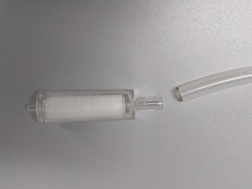
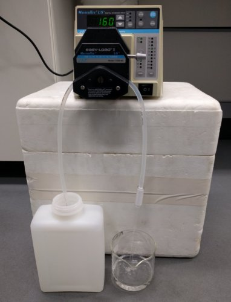

# *SeaDNA* estuary sampling protocols
### Rupert A. Collins :: June 2016

Three sampling protocols are outlined for the *SeaDNA* project using the Sterivex filtration system: 

* **Protocol 1 (best):** Filtering of water samples **with** access to a peristaltic pump within ~3 hours of collection.
* **Protocol 2 (okay, but time consuming):** Water sampling **without** immediate access to peristaltic pump, use of a syringe in the field.
* **Protocol 3 (worst):** Freezing water samples for later peristaltic pumping (freeze/thaw process may degrade DNA).

### Protocol 1

1. Each [**site sampling**](#glossary) requires &times;3 lots of 2 L, and a rate of 10% randomly assigned [**negative controls**](#glossary).
1. Wearing disposible gloves, fasten [**prefilter**](#glossary) to neck of [**sterile**](#glossary) sample collection bottle with an elastic band.

    

1. Rinse bottle in sample water, then submerge bottle and gently collect a subsurface water sample (taking care not to disturb any sediments). Try to sample in water > 50 cm in depth.
1. Place the samples into a pre-chilled coolbox or polystyrene box with ice packs. Label sample bottles with recorder/number/date/site/location using permanent marker (preferably using tape). 
1. Set up the peristaltic pump. Connect [**tubing**](#glossary) with one end in the sample bottle (preferably avoiding the bottom of the bottle), and other to the Sterivex placed over a measuring cylinder or measuring beaker (image below shows Sterivex inlet end on the right). Ensure that the pump is set to pump in the correct direction (i.e. into the Sterivex), and on the correct tube diameter setting (25). Before connecting the Sterivex, pass around 50 ml of sample water to flush the tubing.

    &nbsp;

    

1. Pump at ~150 mL/min until 2 L has passed through the filter. The pump output may need to be increased as the Sterivex saturates with material (it discolours as this happens), but speeds above 300 mL/min may lead to the Sterivex detaching from the tubing. Cable ties can be used to secure it better, but if 2 L cannot be pumped in a timely period (e.g. < 30 mins), stop the pump and record the total volume of water passed.
1. Remove the inlet tube from the water sample and while continuing to pump, allow gravity to dry the Sterivex completely for at least 3 mins (some small residual water drops may remain). 
1. Stop pump, detach the Sterivex, and place it in a prelabelled sample bag containing ~5 g silica granules to remove remaining water. All three Sterivex from each site can be place in the same bag to save space.

    

1. Place the sample bag into a -20°C freezer or pre-chilled coolbox with ice packs until later freezing.

### Protocol 2

1. Carry out steps 1-4 as Protocol 1. 
1. Fill a 50 mL syringe with sample water
1. Attach syringe to a Sterivex filter inlet using the luer lock. 
1. Slowly and steadily push the water through the Sterivex and into a measuring cylinder or measuring beaker.
1. Repeat until 2 L have passed through, or the Sterivex is saturated with material and the syringe plunger cannot be pushed (measuring final volume).
1. Carry out steps 8-9 as Protocol 1.

### Protocol 3

1. Carry out steps 1-4 as Protocol 1.
2. Freeze the water samples as soon as possible after collection in a -20°C freezer.
3. Carry out steps 6-9 (Protocol 1) after gently thawing the water samples at room temperature.

###  Glossary

**Negative control** bottles (1 in 10 of real samples) should be prepared in advance in the lab using one 2 L sample of autoclaved distilled water, and treated identically to the real samples in the field.

**Prefilters** comprise cut two sheets (roughly 120 mm square) of a 250 μm and a 500 μm nylon gauze. They are attached to the neck of the bottle using an elastic band, and are discarded after the water sample is taken. Only the 250 μm gauze may be required for "clean" water samples, while dirty samples may require more than one 500 μm gauze.

Equipment can be **sterilised** by autoclave&mdash;or better&mdash;bleach. Bleach should be standard 5% commercial thin bleach at a ratio of 1:9 with RO water. After soaking in the solution for a minimum of 3 h, equipment should be triple rinsed in deionised/distilled water and then air dried. Ensure bleach penetrates the entire lengths of the tubing. 

Here, **locations** are defined as the general geographical area (e.g. Severn Estuary), while **sites** are specific sampling points within that location (e.g. Portishead Docks 51.494 -2.754).

Cut silicone **tubing** to short (~80 cm) lengths, as they are easier to bleach in shorter lengths, and as clean/dirty equipment can be rotated (i.e. some left drying in the lab while others are in use). 

### Table 1. Parts and prices
Item | Cost (inc VAT)| Company |Part no.
--- | --- | --- |---
Sterivex filter 0.22 &micro;m | £3.96 ea | Millipore | SVGP01050
Peristaltic pump | £800 (used) | Cole-Parmer | Masterflex L/S 7523-60
PowerWater DNA isolation kit | £7.36 ea | MoBio | 14900-100-NF
Silicon tubing (platinum) | £100 per 7.6 m | Cole-Parmer | L/S 25 WZ-96410-25
Whirl-pak sample bag | £47.34 per 500 | SLS/Nasco| B01062WA
50 mL luer-lock syringe | £10.15 per 25 | Greiner Bio-One Ltd | SYR50
Nalgene Bottle 2L PE rectangular | £28.3 per 4  | SLS | BOT0158
250 &micro;m and 500 &micro;m mesh prefilter | £20 per m | Plastok | NA