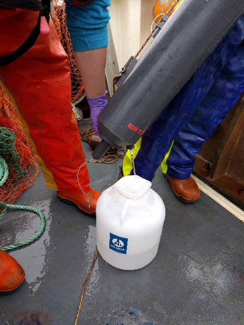
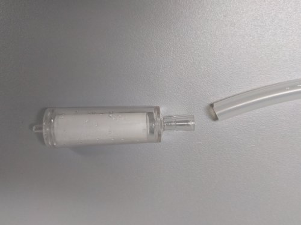
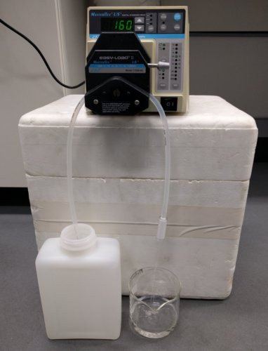
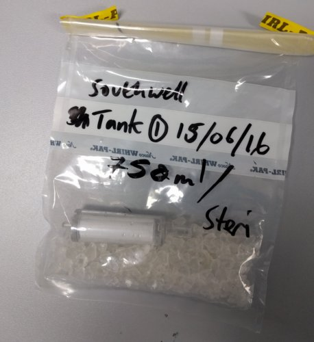
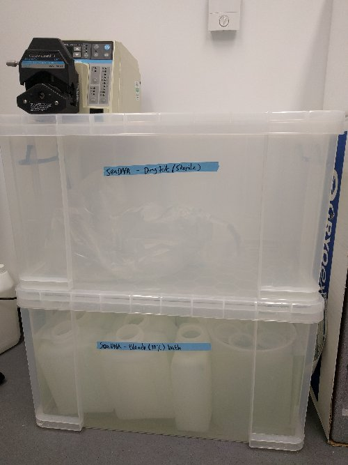

# *SeaDNA* sampling protocols at sea
### Rupert A. Collins :: Jan 2017

Sampling protocol outlined for the *SeaDNA* project, including: (1) project sampling regime; (2) protocol for sampling of water at sea; (3) filtration of water in the lab using the Sterivex filter / peristaltic pump; and (4) sterilisation of equipment after use: 

Please refer to the [**glossary**](#glossary) for definitions of terms (also provided as links).

### Sampling protocol at sea

1. Water will be collected by Niskin bottle at the required depth.
1. Each site (= water depth) requires &times;3 replicates of 2 L seawater
1. A surface sample should be taken at approximately 1.0 m below surface to avoid floating debris; a bottom sample should be taken as close to the substrate as possible without disturbing sediments.
1. The seawater from the Niskin should be poured into a 10 L carboy, through two [**prefilters**](#glossary).

    

1. The bottom sample should be taken first, and then the surface sample taken after rinsing the Niskin in surface water.
1. The Niskin can then be rinsed with freshwater after use.
1. There should be a rate of 5% [**negative controls**](#glossary).
1. Because the vessel is used to regularly catch large numbers of live fishes, the amount of fish DNA on the surfaces of the boat will be huge. Compared to the amount of DNA we expect to find in a small sample of seawater, the potential for contamination is significant.
1. Therefore, disposible gloves should be worn at all times, and changed after each step. Should any part of the vessel or its equipment be touched while gloves are on, they should be changed before any further handling of eDNA sampling equipment. Be aware of brushing eDNA sampling equipment with contaminated clothing or handling parts of the equipment that are likely to be contaminated (e.g. bottom of the carboy) before parts that are not contaminated (e.g. neck and sides of the carboy).
1. Label carboy using permanent marker or adhesive tape. 
1. The carboy can then be placed into a plastic bag and then into a pre-chilled coolbox or poly box with ice or ice packs. 
1. Alternatively, in winter when air temperature is low (< 10&deg;C), the carboy can be taken directly to the lab in the lab without decanting into the Nalgene bottles.

### Filtering protocol in the lab

1. Decontaminate work surfaces with a 10% [**bleach**](#glossary) solution, followed by 70% ethanol.
1. Wearing disposible gloves, set up the peristaltic pump. Connect [**tubing**](#glossary) with one end in the sample bottle (preferably avoiding the bottom of the bottle), and other to the Sterivex placed over a measuring cylinder or measuring beaker (image below shows Sterivex inlet end on the right). Ensure that the pump is set to pump in the correct direction (i.e. into the Sterivex), and on the correct tube diameter setting (25). Before connecting the Sterivex, pass around 50 ml of sample water to flush the tubing.
1. Try to avoid handling the Sterivex as much as possible, and make sure it does not touch potentially contaminated surfaces.

    &nbsp;

    

1. Pump at < 150 mL/min until 2 L has passed through the filter. The pump output may need to be increased as the Sterivex saturates with material (it discolours as this happens), but high speeds may lead to the Sterivex detaching from the tubing. Cable ties can be used to secure it better, but if 2 L cannot be pumped in a timely period (e.g. < 25 mins), stop the pump and record the total volume of water passed.
1. Remove the inlet tube from the water sample and while continuing to pump, allow gravity to dry the Sterivex completely for at least 30 seconds (some small residual water drops may remain).
1. Stop pump, detach the Sterivex, and place it in a prelabelled Whirl-pak sample bag containing about 20 silica granules (you don't need to count them) to remove remaining water (image shows excessive granules). All three Sterivex from each site can be placed in the same bag to save space. Alternatively one Sterivex can be placed in a 50 mL Falcon tube.
1. Label bag/tube with date, location, site, personel, reference etc. Labelling can be either permanent marker on outside of bag, or pencil / gel pen on archive / waterproof paper on inside of bag.

    

1. Place the sample bag into a second bag (e.g. regular ziplock), and then into -20°C freezer that is not being used to store PCR products or fish (freezer with tissue samples and lab reagents is okay).
1. Samples will be collected regularly. Please advise when freezer space is getting low.

### Equipment sterilisation

1. After use, all equipment should be sterilised and made clean for the next use.
1. Nalgene bottles, pump tubing, and funnels can be submerged in 10% [**bleach**](#glossary) solution in a ~84 L Staples plastic storage box. 
1.  The equipment must be soaked for a minimum of 3 h (longer is okay).
1.  Ensure bleach penetrates the entire lengths of the tubing (i.e. there are no bubbles inside). 

    

1.  Equipment should be triple rinsed in deionised/distilled water and then air dried on paper towels in a clean room or fume hood free of PCR products or fish contamination, and then placed in a clean plastic bag inside a clean dry storage box.
1. The bleach solution must be changed every three weeks (see associated COSHH and risk assessment for bleach use).
1. Carboys will not fit in the bleach bath, but can be filled with bleach solution from the bath, and wiped down to decontaminate external surfaces.
1. Remember to also wipe down the coolbox used to transport the samples with bleach.

###  Glossary

**Negative control** samples should be prepared in advance in the lab using one 2 L sample of distilled water in a randomly chosen Nalgene bottle, and treated identically to the real samples in the field, including being opened and closed and handled. Negative control samples should represent ~5% of real samples, i.e. one in every 18 samples, which corresponds to one negative control on every three trips to sea.

**Prefilters** comprise sheets of a 250 μm and a 500 μm nylon gauze. Prefilters can be secured via elastic band, or cut to fit a plastic funnel. Prefilter may not be required for very low plankton densities. Prefilters should be discarded after use. Add more prefilters for dirty samples.

**Bleach** should be used to sterilise equipment. A 10% bleach solution comprises standard 5% (sodium hypochlorite) commercial thin bleach at a ratio of 1:9 with deionised water. 

**Locations** are defined following usual terminology (e.g. code numbers), while **sites** are specific sampling points within that location (e.g. 1 m depth and 50 m depth).

**Tubing** for the pump should be cut to short lengths (~80 cm), as they are easier to bleach, and as clean/dirty equipment can be rotated (i.e. some left drying in the lab while others are in use). 

### Table 1. Parts and prices
Item | Cost (inc VAT)| Company |Part no.
--- | --- | --- |---
Sterivex filter 0.22 &micro;m | £3.96 ea | Millipore | SVGP01050
Peristaltic pump | £800 (used) | Cole-Parmer | Masterflex L/S 7523-60
PowerWater DNA isolation kit | £7.36 ea | MoBio | 14900-100-NF
Silicon tubing (platinum) | £100 per 7.6 m | Cole-Parmer | L/S 25 WZ-96410-25
Whirl-pak sample bag | £47.34 per 500 | SLS/Nasco| B01062WA
50 mL luer-lock syringe | £10.15 per 25 | Greiner Bio-One Ltd | SYR50
Nalgene Bottle 2L PE rectangular | £28.3 per 4  | SLS | BOT0158
250 &micro;m and 500 &micro;m mesh prefilter | £20 per m | Plastok | NA